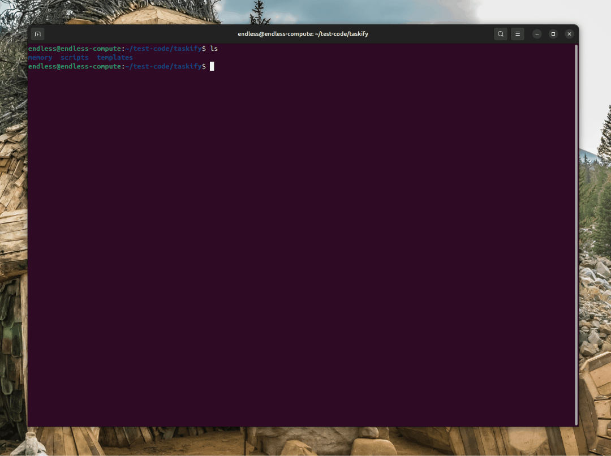

<div align="center">
    
    <h1>🌱 Spec Kit</h1>
    <h3><em>更快地建立高品質軟體。</em></h3>
</div>

<p align="center">
    <strong>一個開源工具包，讓您專注於產品情境和可預測的結果，而不是從頭開始隨意編寫程式碼。</strong>
</p>

<p align="center">
    <a href="https://github.com/github/spec-kit/actions/workflows/release.yml"></a>
    <a href="https://github.com/github/spec-kit/stargazers"></a>
    <a href="https://github.com/github/spec-kit/blob/main/LICENSE"></a>
    <a href="https://github.github.io/spec-kit/"></a>
</p>

---

## 目錄

- [🤔 什麼是規格驅動開發？](#-什麼是規格驅動開發)
- [⚡ 開始使用](#-開始使用)
- [📽️ 影片概覽](#️-影片概覽)
- [🤖 支援的 AI 代理](#-支援的-ai-代理)
- [🔧 Specify CLI 參考](#-specify-cli-參考)
- [📚 核心理念](#-核心理念)
- [🌟 開發階段](#-開發階段)
- [🎯 實驗目標](#-實驗目標)
- [🔧 先決條件](#-先決條件)
- [📖 了解更多](#-了解更多)
- [📋 詳細流程](#-詳細流程)
- [🔍 疑難排解](#-疑難排解)
- [👥 維護者](#-維護者)
- [💬 支援](#-支援)
- [🙏 致謝](#-致謝)
- [📄 授權](#-授權)

## 🤔 什麼是規格驅動開發？

規格驅動開發 (Spec-Driven Development) **顛覆了**傳統軟體開發模式。數十年來，程式碼一直是核心 — 規格只是我們在「真正的工作」開始後建立並丟棄的鷹架。規格驅動開發改變了這一點：**規格變得可執行**，直接產生可運作的實作，而不僅僅是引導它們。

## ⚡ 開始使用

### 1. 安裝 Specify CLI

選擇您偏好的安裝方法：

#### 選項 1：永久安裝 (建議)

安裝一次，隨處使用：

```bash
uv tool install specify-cli --from git+https://github.com/github/spec-kit.git
```

然後直接使用該工具：

```bash
specify init <專案名稱>
specify check
```

要升級 Specify，請參閱 [升級指南](./docs/upgrade.md) 以獲取詳細說明。快速升級：

```bash
uv tool install specify-cli --force --from git+https://github.com/github/spec-kit.git
```

#### 選項 2：一次性使用

無需安裝即可直接執行：

```bash
uvx --from git+https://github.com/github/spec-kit.git specify init <專案名稱>
```

**永久安裝的優點：**

- 工具保持安裝並在 PATH 中可用
- 無需建立 shell 別名
- 透過 `uv tool list`、`uv tool upgrade`、`uv tool uninstall` 更好地管理工具
- 更簡潔的 shell 配置

### 2. 建立專案原則

在專案目錄中啟動您的 AI 助理。助理中提供 `/speckit.*` 命令。

使用 **`/speckit.constitution`** 命令來建立專案的管理原則和開發指南，這些原則將指導所有後續開發。

```bash
/speckit.constitution 建立專注於程式碼品質、測試標準、使用者體驗一致性和效能要求的原則
```

### 3. 建立規格

使用 **`/speckit.specify`** 命令來描述您想要建立的內容。專注於**什麼**和**為什麼**，而不是技術堆疊。

```bash
/speckit.specify 建立一個應用程式，可以幫助我將照片整理到不同的相簿中。相簿按日期分組，並可以在主頁上透過拖放重新整理。相簿永遠不會嵌套在其他相簿中。在每個相簿中，照片以圖塊介面預覽。
```

### 4. 建立技術實作計畫

使用 **`/speckit.plan`** 命令提供您的技術堆疊和架構選擇。

```bash
/speckit.plan 該應用程式使用 Vite，並盡可能少地使用函式庫。盡可能使用原生的 HTML、CSS 和 JavaScript。圖片不會上傳到任何地方，Metadata 儲存在本地 SQLite 資料庫中。
```

### 5. 分解為任務

使用 **`/speckit.tasks`** 從您的實作計畫中建立一個可執行的任務列表。

```bash
/speckit.tasks
```

### 6. 執行實作

使用 **`/speckit.implement`** 執行所有任務並根據計畫建立您的功能。

```bash
/speckit.implement
```

有關詳細的逐步說明，請參閱我們的 [綜合指南](./spec-driven.md)。

## 📽️ 影片概覽

想看看 Spec Kit 的實際運作嗎？觀看我們的 [影片概覽](https://www.youtube.com/watch?v=a9eR1xsfvHg&pp=0gcJCckJAYcqIYzv)！

[](https://www.youtube.com/watch?v=a9eR1xsfvHg&pp=0gcJCckJAYcqIYzv)

## 🤖 支援的 AI 代理

| 代理                                                       | 支援 | 備註                                             |
|-----------------------------------------------------------|----|---------------------------------------------------|
| [Amazon Q Developer CLI](https://aws.amazon.com/developer/learning/q-developer-cli/) | ⚠️ | Amazon Q Developer CLI [不支援](https://github.com/aws/amazon-q-developer-cli/issues/3064) 斜線命令的自訂引數。 |
| [Amp](https://ampcode.com/)                               | ✅ | |
| [Auggie CLI](https://docs.augmentcode.com/cli/overview)   | ✅ |                                                   |
| [Claude Code](https://www.anthropic.com/claude-code)      | ✅ |                                                   |
| [CodeBuddy CLI](https://www.codebuddy.ai/cli)             | ✅ |                                                   |
| [Codex CLI](https://github.com/openai/codex)              | ✅ |                                                   |
| [Cursor](https://cursor.sh/)                              | ✅ |                                                   |
| [Gemini CLI](https://github.com/google-gemini/gemini-cli) | ✅ |                                                   |
| [GitHub Copilot](https://code.visualstudio.com/)          | ✅ |                                                   |
| [IBM Bob](https://www.ibm.com/products/bob)               | ✅ | 基於 IDE 的代理，支援斜線命令 |
| [Jules](https://jules.google.com/)                        | ✅ | |
| [Kilo Code](https://github.com/Kilo-Org/kilocode)         | ✅ |                                                   |
| [opencode](https://opencode.ai/)                          | ✅ |                                                   |
| [Qwen Code](https://github.com/QwenLM/qwen-code)          | ✅ |                                                   |
| [Roo Code](https://roocode.com/)                          | ✅ |                                                   |
| [SHAI (OVHcloud)](https://github.com/ovh/shai)            | ✅ | |
| [Windsurf](https://windsurf.com/)                         | ✅ |                                                   |


## 🔧 Specify CLI 參考

`specify` 命令支援以下選項：

### 命令

| 命令     | 描述                                                    |
|-------------|----------------------------------------------------------------|
| `init`      | 從最新的範本初始化新的 Specify 專案      |
| `check`     | 檢查已安裝的工具 (`git`、`claude`、`gemini`、`code`/`code-insiders`、`cursor-agent`、`windsurf`、`qwen`、`opencode`、`codex`、`shai`) |

### `specify init` 引數與選項

| 引數/選項        | 類型     | 描述                                                                  |
|------------------------|----------|------------------------------------------------------------------------------|
| `<專案名稱>`       | 引數 | 新專案目錄的名稱 (如果使用 `--here` 則為選用，或使用 `.` 表示目前目錄) |
| `--ai`                 | 選項   | 要使用的 AI 助理：`claude`、`gemini`、`copilot`、`cursor-agent`、`qwen`、`opencode`、`codex`、`windsurf`、`kilocode`、`auggie`、`roo`、`codebuddy`、`amp`、`shai`、`q` 或 `bob` |
| `--script`             | 選項   | 要使用的指令碼變體：`sh` (bash/zsh) 或 `ps` (PowerShell)                 |
| `--ignore-agent-tools` | 旗標     | 跳過對 Claude Code 等 AI 代理工具的檢查                             |
| `--no-git`             | 旗標     | 跳過 git 儲存庫初始化                                          |
| `--here`               | 旗標     | 在目前目錄中初始化專案，而不是建立新專案   |
| `--force`              | 旗標     | 在目前目錄中初始化時強制合併/覆寫 (跳過確認) |
| `--skip-tls`           | 旗標     | 跳過 SSL/TLS 驗證 (不建議)                                 |
| `--debug`              | 旗標     | 啟用詳細的偵錯輸出以進行疑難排解                            |
| `--github-token`       | 選項   | 用於 API 請求的 GitHub 權杖 (或設定 GH_TOKEN/GITHUB_TOKEN 環境變數)  |

### 範例

```bash
# 基本專案初始化
specify init my-project

# 使用特定的 AI 助理初始化
specify init my-project --ai claude

# 使用 Cursor 支援初始化
specify init my-project --ai cursor-agent

# 使用 Windsurf 支援初始化
specify init my-project --ai windsurf

# 使用 Amp 支援初始化
specify init my-project --ai amp

# 使用 SHAI 支援初始化
specify init my-project --ai shai

# 使用 IBM Bob 支援初始化
specify init my-project --ai bob

# 使用 PowerShell 指令碼初始化 (Windows/跨平台)
specify init my-project --ai copilot --script ps

# 在目前目錄中初始化
specify init . --ai copilot
# 或使用 --here 旗標
specify init --here --ai copilot

# 強制合併到目前 (非空) 目錄，無需確認
specify init . --force --ai copilot
# 或
specify init --here --force --ai copilot

# 跳過 git 初始化
specify init my-project --ai gemini --no-git

# 啟用偵錯輸出以進行疑難排解
specify init my-project --ai claude --debug

# 使用 GitHub 權杖進行 API 請求 (適用於企業環境)
specify init my-project --ai claude --github-token ghp_your_token_here

# 檢查系統要求
specify check
```

### 可用的斜線命令

執行 `specify init` 後，您的 AI 程式碼代理將可存取這些斜線命令以進行結構化開發：

#### 核心命令

規格驅動開發工作流程的基本命令：

| 命令                  | 描述                                                           |
|--------------------------|-----------------------------------------------------------------------|
| `/speckit.constitution`  | 建立或更新專案管理原則和開發指南 |
| `/speckit.specify`       | 定義您想要建立的內容 (要求和使用者故事)        |
| `/speckit.plan`          | 使用您選擇的技術堆疊建立技術實作計畫     |
| `/speckit.tasks`         | 產生可執行的實作任務列表                     |
| `/speckit.implement`     | 根據計畫執行所有任務並建立功能         |

#### 選用命令

用於增強品質和驗證的額外命令：

| 命令              | 描述                                                           |
|----------------------|-----------------------------------------------------------------------|
| `/speckit.clarify`   | 釐清未明確定義的區域 (建議在 `/speckit.plan` 之前；以前為 `/quizme`) |
| `/speckit.analyze`   | 跨構件一致性與覆蓋率分析 (在 `/speckit.tasks` 之後，`/speckit.implement` 之前執行) |
| `/speckit.checklist` | 產生自訂品質檢查表，驗證要求完整性、清晰度和一致性 (例如「英文單元測試」) |

### 環境變數

| 變數         | 描述                                                                                    |
|------------------|------------------------------------------------------------------------------------------------|
| `SPECIFY_FEATURE` | 覆寫非 Git 儲存庫的功能偵測。設定為功能目錄名稱 (例如 `001-photo-albums`)，以便在不使用 Git 分支時處理特定功能。<br/>**必須在使用 `/speckit.plan` 或後續命令之前，在您正在使用的代理環境中設定。** |

## 📚 核心理念

規格驅動開發是一個結構化的流程，強調：

- **意圖驅動開發**，其中規格在「如何做」之前定義「做什麼」
- 使用護欄和組織原則**建立豐富的規格**
- **多步驟細化**，而不是從提示一次性產生程式碼
- **高度依賴**進階 AI 模型功能來解釋規格

## 🌟 開發階段

| 階段 | 焦點 | 主要活動 |
|-------|-------|----------------|
| **從 0 到 1 開發** (「綠地」) | 從頭開始產生 | <ul><li>從高階要求開始</li><li>產生規格</li><li>規劃實作步驟</li><li>建立生產就緒的應用程式</li></ul> |
| **創意探索** | 平行實作 | <ul><li>探索多樣化的解決方案</li><li>支援多種技術堆疊和架構</li><li>實驗使用者體驗模式</li></ul> |
| **迭代增強** (「棕地」) | 棕地現代化 | <ul><li>迭代新增功能</li><li>現代化舊有系統</li><li>調整流程</li></ul> |

## 🎯 實驗目標

我們的研究和實驗重點是：

### 技術獨立性

- 使用多樣化的技術堆疊建立應用程式
- 驗證規格驅動開發是一個不依賴特定技術、程式語言或框架的流程的假設

### 企業限制

- 展示關鍵任務應用程式開發
- 納入組織限制 (雲端供應商、技術堆疊、工程實踐)
- 支援企業設計系統和合規要求

### 以使用者為中心的開發

- 為不同的使用者群體和偏好建立應用程式
- 支援各種開發方法 (從隨意編碼到 AI 原生開發)

### 創意與迭代流程

- 驗證平行實作探索的概念
- 提供強大的迭代功能開發工作流程
- 擴展流程以處理升級和現代化任務

## 🔧 先決條件

- **Linux/macOS/Windows**
- [支援的](#-支援的-ai-代理) AI 程式碼代理。
- [uv](https://docs.astral.sh/uv/) 用於套件管理
- [Python 3.11+](https://www.python.org/downloads/)
- [Git](https://git-scm.com/downloads)

如果您遇到代理問題，請開啟一個問題，以便我們改進整合。

## 📖 了解更多

- **[完整的規格驅動開發方法](./spec-driven.md)** - 深入了解完整流程
- **[詳細逐步解說](#-詳細流程)** - 逐步實作指南

---

## 📋 詳細流程

<details>
<summary>點擊展開詳細的逐步解說</summary>

您可以使用 Specify CLI 來引導您的專案，這將在您的環境中引入所需的構件。執行：

```bash
specify init <專案名稱>
```

或在目前目錄中初始化：

```bash
specify init .
# 或使用 --here 旗標
specify init --here
# 當目錄已包含檔案時跳過確認
specify init . --force
# 或
specify init --here --force
```


系統將提示您選擇正在使用的 AI 代理。您也可以直接在終端機中主動指定它：

```bash
specify init <專案名稱> --ai claude
specify init <專案名稱> --ai gemini
specify init <專案名稱> --ai copilot

# 或在目前目錄中：
specify init . --ai claude
specify init . --ai codex

# 或使用 --here 旗標
specify init --here --ai claude
specify init --here --ai codex

# 強制合併到非空的目前目錄
specify init . --force --ai claude

# 或
specify init --here --force --ai claude
```

CLI 將檢查您是否已安裝 Claude Code、Gemini CLI、Cursor CLI、Qwen CLI、opencode、Codex CLI 或 Amazon Q Developer CLI。如果您沒有安裝，或者您希望在不檢查正確工具的情況下取得範本，請在命令中使用 `--ignore-agent-tools`：

```bash
specify init <專案名稱> --ai claude --ignore-agent-tools
```

### **步驟 1：** 建立專案原則

進入專案資料夾並執行您的 AI 代理。在我們的範例中，我們使用 `claude`。



如果您看到 `/speckit.constitution`、`/speckit.specify`、`/speckit.plan`、`/speckit.tasks` 和 `/speckit.implement` 命令可用，則表示設定正確。

第一步應該是使用 `/speckit.constitution` 命令建立專案的管理原則。這有助於確保在所有後續開發階段中決策的一致性：

```text
/speckit.constitution 建立專注於程式碼品質、測試標準、使用者體驗一致性和效能要求的原則。包含這些原則應如何指導技術決策和實作選擇的治理。
```

此步驟會建立或更新 `.specify/memory/constitution.md` 檔案，其中包含專案的基礎指南，AI 代理將在規格、規劃和實作階段中參考這些指南。

### **步驟 2：** 建立專案規格

建立專案原則後，您現在可以建立功能規格。使用 `/speckit.specify` 命令，然後提供您想要開發的專案的具體要求。

>[!IMPORTANT]
>盡可能明確地說明您要建立**什麼**以及**為什麼**。**此時不要專注於技術堆疊**。

範例提示：

```text
開發 Taskify，一個團隊生產力平台。它應該允許使用者建立專案、新增團隊成員、
分配任務、評論並在看板樣式中移動任務。在此功能的初始階段，
我們稱之為「建立 Taskify」，我們將有多個使用者，但使用者將預先聲明、預先定義。
我想要五個使用者，分為兩個不同的類別，一個產品經理和四個工程師。讓我們建立三個
不同的範例專案。讓我們為每個任務的狀態設定標準看板欄位，例如「待辦事項」、
「進行中」、「審查中」和「完成」。此應用程式將不提供登入功能，因為這只是
第一個測試，以確保我們的基本功能已設定。對於任務卡片 UI 中的每個任務，
您應該能夠在看板工作板的不同欄位之間變更任務的目前狀態。
您應該能夠為特定卡片留下無限數量的評論。您應該能夠從該任務卡片中
指派其中一個有效使用者。當您第一次啟動 Taskify 時，它會為您提供五個使用者列表供您選擇。
無需密碼。當您點擊使用者時，您會進入主檢視，其中顯示專案列表。
當您點擊專案時，您會開啟該專案的看板。您會看到欄位。
您將能夠在不同欄位之間拖放卡片。您會看到指派給您 (目前登入的使用者) 的任何卡片，
其顏色與所有其他卡片不同，因此您可以快速查看您的卡片。您可以編輯您所做的任何評論，
但不能編輯其他人所做的評論。您可以刪除您所做的任何評論，但不能刪除其他人所做的評論。
```

輸入此提示後，您應該會看到 Claude Code 啟動規劃和規格草擬流程。Claude Code 還會觸發一些內建指令碼來設定儲存庫。

此步驟完成後，您應該會建立一個新分支 (例如 `001-create-taskify`)，以及 `specs/001-create-taskify` 目錄中的新規格。

產生的規格應包含一組使用者故事和功能要求，如範本中所定義。

在此階段，您的專案資料夾內容應類似於以下內容：

```text
└── .specify
    ├── memory
    │  └── constitution.md
    ├── scripts
    │  ├── check-prerequisites.sh
    │  ├── common.sh
    │  ├── create-new-feature.sh
    │  ├── setup-plan.sh
    │  └── update-claude-md.sh
    ├── specs
    │  └── 001-create-taskify
    │      └── spec.md
    └── templates
        ├── plan-template.md
        ├── spec-template.md
        └── tasks-template.md
```

### **步驟 3：** 功能規格釐清 (規劃前必須)

建立基準規格後，您可以繼續釐清在第一次嘗試中未正確擷取的任何要求。

您應該在建立技術計畫**之前**執行結構化釐清工作流程，以減少下游的重複工作。

偏好順序：

1. 使用 `/speckit.clarify` (結構化) – 循序、基於覆蓋率的問題，將答案記錄在「釐清」部分。
2. 如果仍有模糊之處，可選擇性地進行臨時自由形式細化。

如果您有意跳過釐清 (例如，探索性原型)，請明確說明，以便代理不會因缺少釐清而受阻。

範例自由形式細化提示 (如果仍需要，在 `/speckit.clarify` 之後)：

```text
對於您建立的每個範例專案或專案，任務數量應在 5 到 15 個之間，
每個任務隨機分佈到不同的完成狀態。確保每個完成階段至少有一個任務。
```

您還應該要求 Claude Code 驗證「**審查與接受檢查表**」，勾選已驗證/符合要求的事項，並將未勾選的事項留空。可以使用以下提示：

```text
閱讀審查與接受檢查表，如果功能規格符合條件，請勾選檢查表中的每個項目。如果不符合，請留空。
```

重要的是要利用與 Claude Code 的互動來釐清和詢問有關規格的問題 — **不要將其第一次嘗試視為最終結果**。

### **步驟 4：** 產生計畫

您現在可以具體說明技術堆疊和其他技術要求。您可以使用專案範本中內建的 `/speckit.plan` 命令，並使用類似以下的提示：

```text
我們將使用 .NET Aspire 產生此內容，並使用 Postgres 作為資料庫。前端應使用
Blazor 伺服器，具有拖放任務板、即時更新。應建立一個 REST API，包含專案 API、
任務 API 和通知 API。
```

此步驟的輸出將包含許多實作細節文件，您的目錄樹將類似於以下內容：

```text
.
├── CLAUDE.md
├── memory
│  └── constitution.md
├── scripts
│  ├── check-prerequisites.sh
│  ├── common.sh
│  ├── create-new-feature.sh
│  ├── setup-plan.sh
│  └── update-claude-md.sh
├── specs
│  └── 001-create-taskify
│      ├── contracts
│      │  ├── api-spec.json
│      │  └── signalr-spec.md
│      ├── data-model.md
│      ├── plan.md
│      ├── quickstart.md
│      ├── research.md
│      └── spec.md
└── templates
    ├── CLAUDE-template.md
    ├── plan-template.md
    ├── spec-template.md
    └── tasks-template.md
```

檢查 `research.md` 文件，確保根據您的指示使用了正確的技術堆疊。如果任何元件突出，您可以要求 Claude Code 進行細化，甚至讓它檢查您想要使用的平台/框架 (例如 .NET) 的本地安裝版本。

此外，您可能希望要求 Claude Code 研究有關所選技術堆疊的詳細資訊，如果它正在快速變化 (例如 .NET Aspire、JS 框架)，可以使用類似以下的提示：

```text
我希望您仔細檢查實作計畫和實作細節，尋找可以從額外研究中受益的領域，因為 .NET Aspire 是一個快速變化的函式庫。對於您確定需要進一步研究的那些領域，我希望您更新研究文件，其中包含有關我們將在此 Taskify 應用程式中使用的特定版本的額外詳細資訊，並產生平行研究任務，以透過網路研究釐清任何詳細資訊。
```

在此過程中，您可能會發現 Claude Code 陷入研究錯誤事物的困境 — 您可以使用類似以下的提示來幫助它朝正確的方向前進：

```text
我認為我們需要將其分解為一系列步驟。首先，確定您在實作過程中需要執行但您不確定或會從進一步研究中受益的任務列表。寫下這些任務的列表。然後對於這些任務中的每一個，我希望您啟動一個單獨的研究任務，以便最終結果是我們正在平行研究所有這些非常具體的任務。我看到您所做的是，您似乎正在研究 .NET Aspire，我認為這在這種情況下對我們沒有多大幫助。那太過於沒有目標的研究了。研究需要幫助您解決一個特定的目標問題。
```

>[!NOTE]
>Claude Code 可能會過於熱心，並新增您未要求的功能。要求它釐清變更的理由和來源。

### **步驟 5：** 讓 Claude Code 驗證計畫

計畫到位後，您應該讓 Claude Code 執行它，以確保沒有遺漏任何部分。您可以使用類似以下的提示：

```text
現在我希望您審核實作計畫和實作細節檔案。
仔細閱讀它，以確定是否有您需要執行的任務序列，這些任務從閱讀中顯而易見。因為我不知道這裡是否有足夠的內容。例如，
當我查看核心實作時，參考實作中適當的位置會很有用
它可以在核心實作或細化中逐步找到資訊的詳細資訊。
```

這有助於細化實作計畫，並幫助您避免 Claude Code 在規劃週期中遺漏的潛在盲點。一旦初始細化通過完成，請要求 Claude Code 再次檢查清單，然後您才能進行實作。

您還可以要求 Claude Code (如果您已安裝 [GitHub CLI](https://docs.github.com/en/github-cli/github-cli)) 從您目前的分支建立一個包含詳細描述的拉取請求到 `main`，以確保工作得到適當的追蹤。

>[!NOTE]
>在讓代理實作之前，還值得提示 Claude Code 交叉檢查詳細資訊，看看是否有任何過度設計的部分 (請記住 — 它可能會過於熱心)。如果存在過度設計的元件或決策，您可以要求 Claude Code 解決它們。確保 Claude Code 遵循 [憲法](base/memory/constitution.md) 作為其在建立計畫時必須遵守的基礎。

### **步驟 6：** 使用 /speckit.tasks 產生任務分解

實作計畫驗證後，您現在可以將計畫分解為可以按正確順序執行的特定、可執行的任務。使用 `/speckit.tasks` 命令從您的實作計畫自動產生詳細的任務分解：

```text
/speckit.tasks
```

此步驟會在您的功能規格目錄中建立一個 `tasks.md` 檔案，其中包含：

- **按使用者故事組織的任務分解** - 每個使用者故事都成為一個單獨的實作階段，並有其自己的任務集
- **依賴項管理** - 任務按組件之間的依賴項排序 (例如，模型在服務之前，服務在端點之前)
- **平行執行標記** - 可以平行執行的任務標記為 `[P]` 以優化開發工作流程
- **檔案路徑規格** - 每個任務都包含應進行實作的確切檔案路徑
- **測試驅動開發結構** - 如果要求測試，則包含測試任務並在實作之前編寫
- **檢查點驗證** - 每個使用者故事階段都包含檢查點以驗證獨立功能

產生的 tasks.md 為 `/speckit.implement` 命令提供了清晰的路線圖，確保系統實作，保持程式碼品質並允許增量交付使用者故事。

### **步驟 7：** 實作

準備就緒後，使用 `/speckit.implement` 命令執行您的實作計畫：

```text
/speckit.implement
```

`/speckit.implement` 命令將：

- 驗證所有先決條件都已到位 (憲法、規格、計畫和任務)
- 從 `tasks.md` 解析任務分解
- 按正確順序執行任務，尊重依賴項和平行執行標記
- 遵循您的任務計畫中定義的 TDD 方法
- 提供進度更新並適當處理錯誤

>[!IMPORTANT]
>AI 代理將執行本地 CLI 命令 (例如 `dotnet`、`npm` 等) — 確保您的機器上已安裝所需的工具。

實作完成後，測試應用程式並解決 CLI 日誌中可能不可見的任何執行時錯誤 (例如，瀏覽器控制台錯誤)。您可以將此類錯誤複製並貼回您的 AI 代理以進行解決。

</details>

---

## 🔍 疑難排解

### Linux 上的 Git 憑證管理員

如果您在 Linux 上遇到 Git 驗證問題，您可以安裝 Git 憑證管理員：

```bash
#!/usr/bin/env bash
set -e
echo "下載 Git 憑證管理員 v2.6.1..."
wget https://github.com/git-ecosystem/git-credential-manager/releases/download/v2.6.1/gcm-linux_amd64.2.6.1.deb
echo "安裝 Git 憑證管理員..."
sudo dpkg -i gcm-linux_amd64.2.6.1.deb
echo "設定 Git 使用 GCM..."
git config --global credential.helper manager
echo "清理中..."
rm gcm-linux_amd64.2.6.1.deb
```

## 👥 維護者

- Den Delimarsky ([@localden](https://github.com/localden))
- John Lam ([@jflam](https://github.com/jflam))

## 💬 支援

如需支援，請開啟 [GitHub 問題](https://github.com/github/spec-kit/issues/new)。我們歡迎錯誤報告、功能要求以及有關使用規格驅動開發的問題。

## 🙏 致謝

此專案深受 [John Lam](https://github.com/jflam) 的工作和研究影響並以此為基礎。

## 📄 授權

此專案根據 MIT 開源授權條款授權。請參閱 [LICENSE](./LICENSE) 檔案以獲取完整條款。
